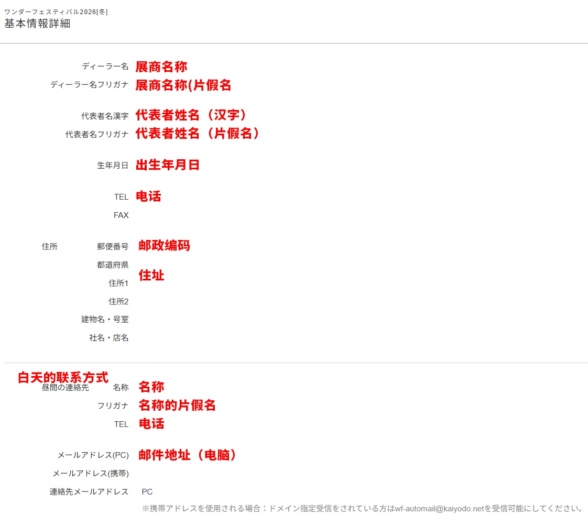
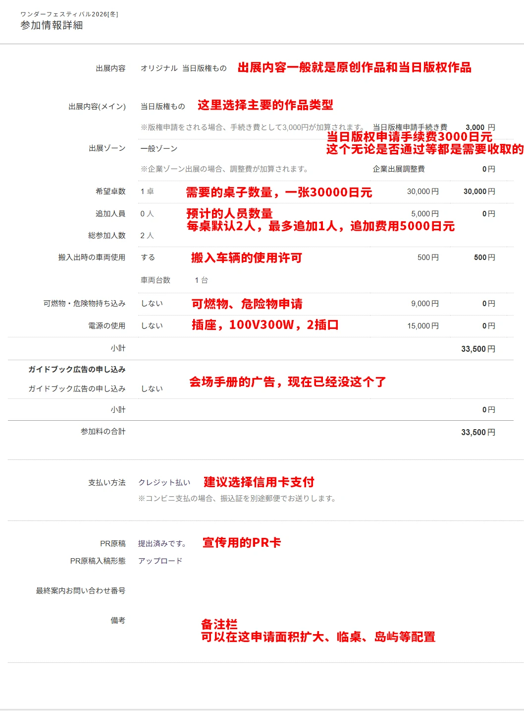

# WF参展流程

## 第一阶段：注册与摊位申请（1~3）

### 1.注册WF Dealer账号

需要长期在日生活的人作为代表人，提供姓名、住址、电话等。

### 2.（可选）登记原型师信息

方便调用。

### 3.申请参展

（抽选制，真的会坠机orz）

> 可以申请和特定展商相邻，双方一起备注，还有想申请一个岛之类的

需要一张visa/master的信用卡，桌子费用30000（好像涨到32000还33000了？），车辆使用、电源使用的申请也要一并递交，后续补充如果太晚的话需要额外手续费。

---

## 第二阶段：版权预备申请（4~7）

### 4.申请参展的同时进行版权预备申请

告知版权方大概想做一个怎样的作品，纯文字，不需要任何照片。

这里需要大概的尺寸、比例、价格等，但后续本申请能改一部分。

### 5.在9.1前上传pr-card

后续公开参展商地图等等时会显示在wf官网的，后续可发邮件更改。

### 6.到9.13号发表当落选通知

### 7.预备申请结果通知

预备申请结束后预备申请是否通过的通知随时都有可能发出，会有邮件的。也有到本申请阶段时也没有回复的可能，但不影响本申请。

预备申请通过时一般会附带一条版权方的消息，当日需要提出样品之类的话。

另外，进入本申请阶段后，即使本申请还没通过也有可能收到来自版权方的信息（大概是因为这时版权方才处理了预备申请，这种情况是没有“预备申请结果到达”之类的通知的。需要自己及时查看）。

---

## 第三阶段：版权本申请与资料往来（8~10）

### 8.本申请

本申请需要提供接近完成品的五张彩色照片，我因为第一次参加怕出事很早就做了色样就交了。除此之外使用到的水贴等其他附属品也需要额外邮箱发送照片（说明书不需要）。

色样没完成的话，灰模图/3d图（禁止渲染边缘线）也是可以的，但肯定是色样通过率最高。

本申请还需最终确认：

- 尺寸
- 比例
- 价格
- 个数等

本申请结束后需要等待通知，一般在12月开始陆续发出，一直到1.13前都有可能发出。

#### 本申请通过后

版权方会发送需要：

- 刻印在零件上的版权标记©️
- 打印在包装、说明书上的版权标记©️

在原模上做好版权标记再翻模。

同时还会发送样品要求：

- 仅展示：四张前后左右照片
- 贩卖：贩卖的商品1体 + 4张照片
- 严苛的版权方可能要求提交复数体商品甚至是涂装完成品

通过后需在1.13前支付版权费用，一般是贩卖总额的4%—10%+税。

到这里，线上的操作基本就结束了。

### 9.收到当日版权资料

本申请通过后，WF官方会向先前登录的代表者住址发送关于当日版权的一些资料，包括：

- 注意事项
- 当日版权结果报告书
- 与版权方签订的合同
- 合同签署指导
- 样品标签
- 版权费支付证明

#### 注意事项

务必阅读。

#### 合同

基本上资料都是照着指导填写就行，合同要代表者签字画押，如果是外国人似乎只需要签字。

#### 样品标签

保留到活动当日，或者如果样品准备好了也可以裁掉贴上去。

#### 寄回资料

将合同和支付证明（这个如果是信用卡支付就不需要）寄到指定的地方。

### 10.收到展会资料

随后一段时间，WF官方会再寄来一些资料，包括：

- 展商证
- 车辆使用许可
- 摊位招牌（贴桌子前那个）
- 宅配搬入时要贴的纸（这个如果需要多张得自己复印）
- 当日版权资料交换券（当日版権書類引換券）
- 追加椅子交换卷
- 会场图等资料

#### 宅配搬入

就是提前将货物寄到指定地方保管，活动前一天或当天会场取出。

---

## 第四阶段：活动现场流程（11）

### 11.活动前日与活动当日

#### 前日搬入

活动前日下午四点半开始搬入，七点结束。

东京的冬天很冷，前日搬入时会开更多的车辆入口，会场会比活动当日冷很多，需要注意低温引起的树脂脆化，尤其是打印件。

活动当日几万人进入会场后就很热了。

#### 领取当日版权资料

前日和当日，都可以拿当日版権書類引換券到展商综合案内领取必须的资料：

- 版权贴纸
- 当日版权取得展商证
- 销售报告书

#### 版权贴纸

售卖时每次卖出时再贴上贴纸，没卖完的话要将剩下的贴纸返还。

#### 样品提交

前日和当日，都可以提交样品。

#### 销售报告书

活动开始20分钟后，只要卖完就可以提交销售报告书。

#### 2026W特别规定

> 2026w开场20分钟内展商不能离开自己的摊位，不能展商直接互相进行贩卖，否则会被直接请出场，这次执行的很严厉搞错了很多人，被炎上了

> 对展商间贩卖的限制每届都有可能改变，以前也有一直限制到中午的

#### 活动结束

活动结束后也没有完卖的话还要一起提交剩下的版权贴纸。

- 五点活动结束
- 收摊可以提前
- 七点前需撤离

---

# 附录

## 12.相关参考图片

基本信息的填写：

参加详情的填写：

---

## 13.后记

笔者初次参展，拿不出能有质量保证的作品，便想着找和一样是小白的伙伴参加，于是和在推上认识的日本人一起作为个人展商参加了这次日本WF冬。

关于如何参加日本WF，十几年来其实国内已经有了很多大佬的分享，国内也有越来越多的社团可以帮忙贩卖作品。WF的申请流程不算复杂，也有着非常详尽的参展手册，但对第一次经历的人来讲，语言的壁垒和经验的缺失，难免会让人在想参加时感到有些畏首畏尾。

笔者也是一边查询资料，一边摸索着完成了这次WF的各项线上申请，并请日本友人完成了线下需要填写的资料，总算是成功的（？）参与了这次展会。

总结这篇笔记，也是希望自己的经验，能够成为以后想要参加日本WF的朋友的参考。如此一来，也算是为模型文化的传播，做一些微小的贡献。

文章的整理主要是在回程的飞机上完成的，有介绍不够详尽的地方还请多多包涵。

如果有关于日本WF想询问的其他细节，可以直接向笔者询问，笔者会在自己了解的范围内尽力回答。
