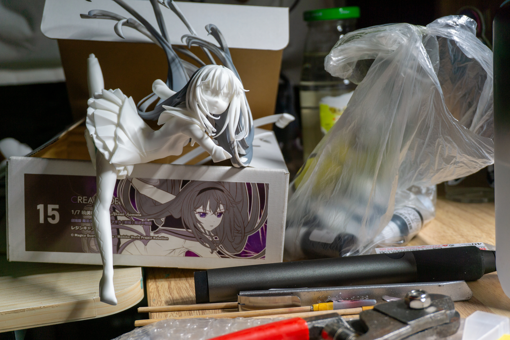
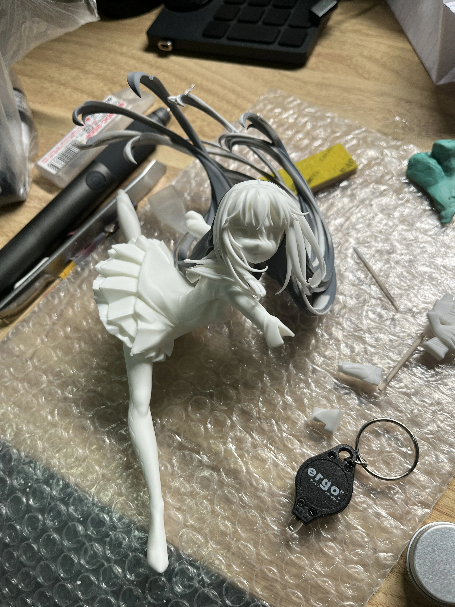
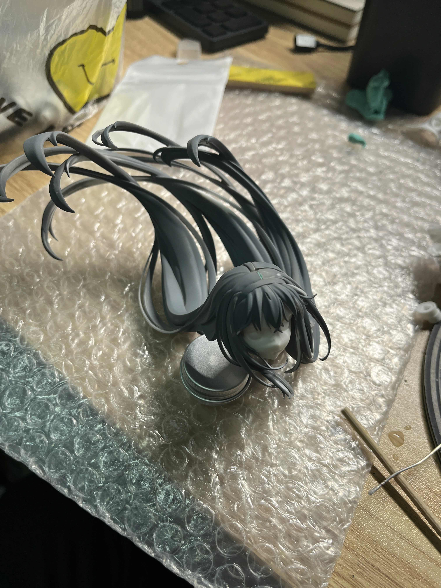
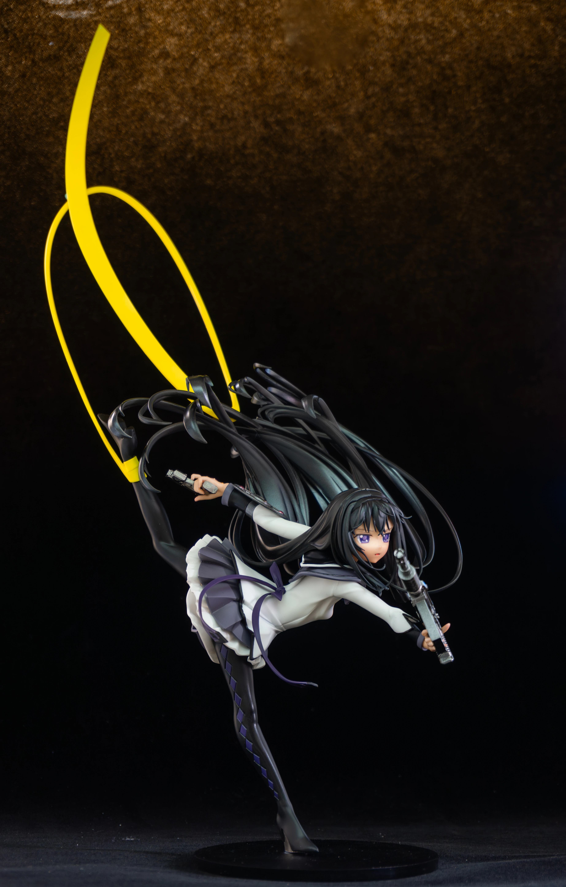

这体CREA MODE的吼姆拉是博主入坑GK的初心。22年的WF冬，那时博主还在上高中，沉迷魔圆，见到造型如此灵动而富有张力的手办非常震撼，了解了一下后知道了GK这么个东西，从那以后就一直梦想能收到这一体吼姆拉。

进入大学之后也是一直在尝试涂装，从纯手涂到喷涂，打磨自己的技术。

后来终于在25年初从一位好心的dalao手中收到了这体吼姆拉

因为已经在网上看了很多这体的开箱、涂装视频，所以到货时相见如故，连头发上的飞边我都认识😂

不过制作这体时，我已经失去了边做边拍的习惯，所以当时的图片只剩下几张了，似乎也写不了什么制作过程。

按qq空间里的记录

- 03.02到货
- 03.02当晚：修头发被气死
- 03.03：修头发被气死
- 03.03：断件
- 03.04：修件修到精神失常
- 03.10：快做好了
- 03.14：做完拍照

当时的效率居然高得有点不可思议。从收到套件到完成拍照，总共也就两周时间。

大概也是因为这体GK在我心里已经放了太久。高中时第一次见到它时，我还只是个觉得GK很厉害的学生；等真正把它完成摆在桌上的时候，自己已经能够独立完成打磨、修件、喷涂和摄影了。

