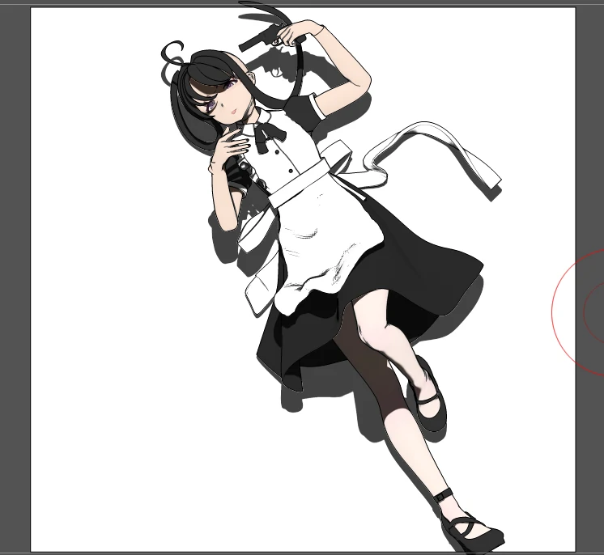
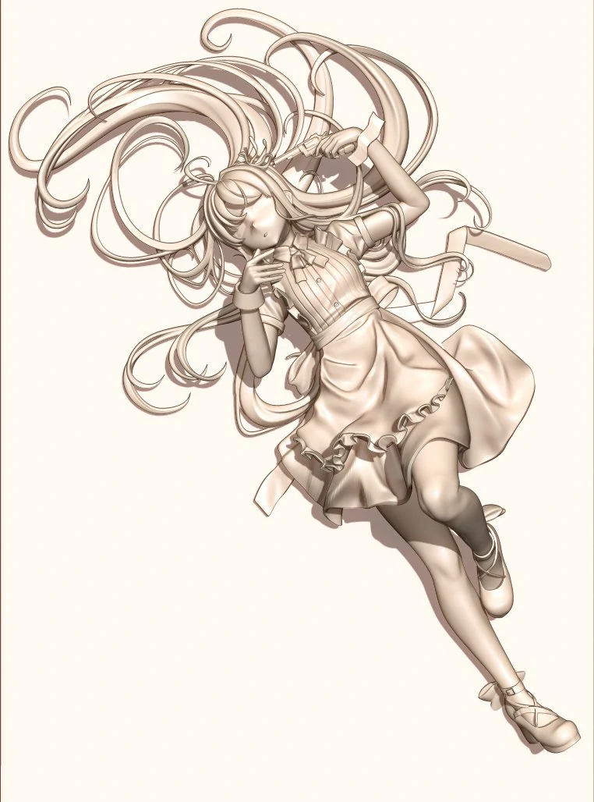
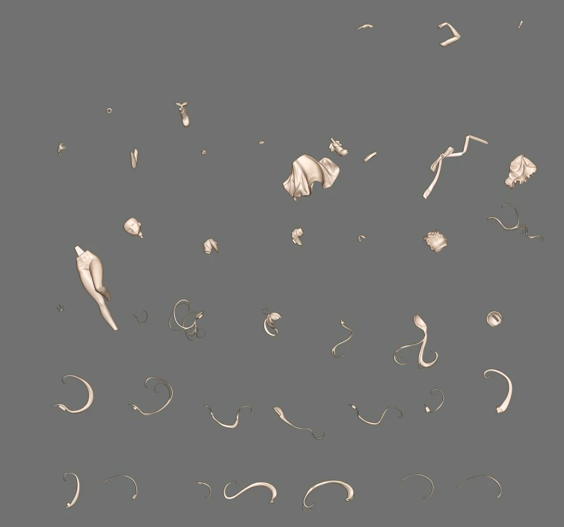
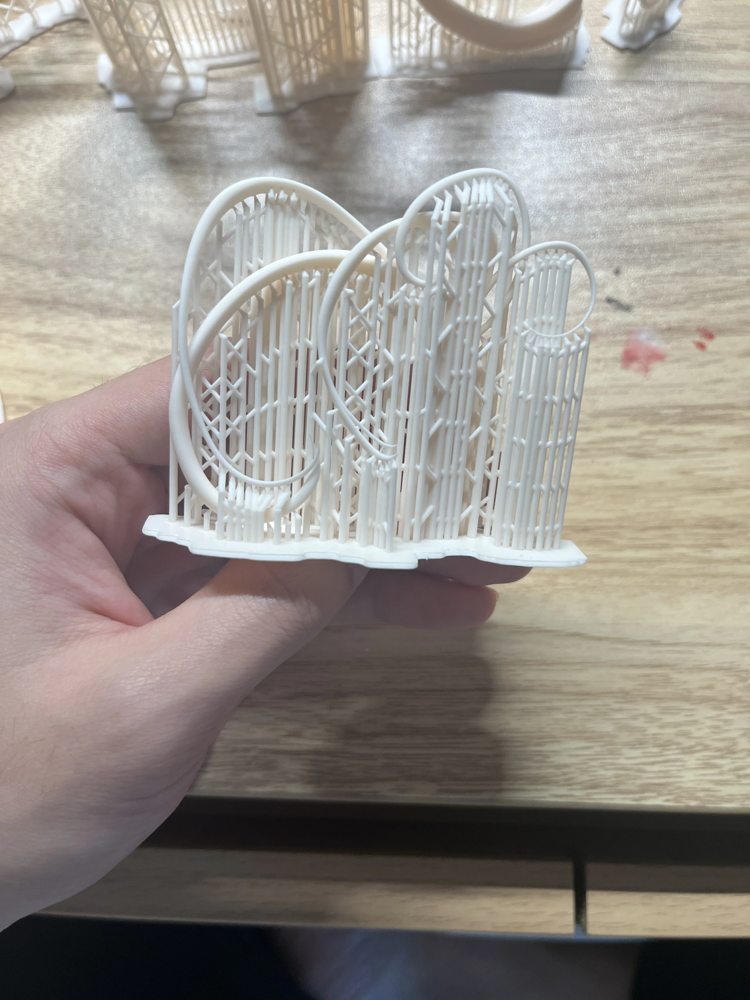
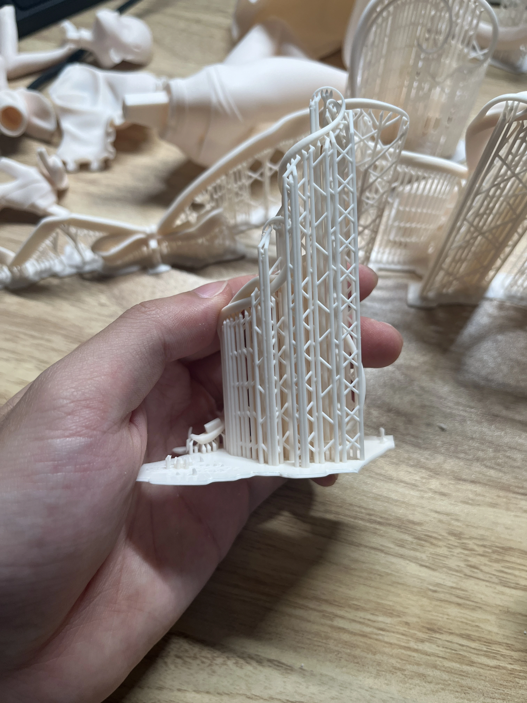
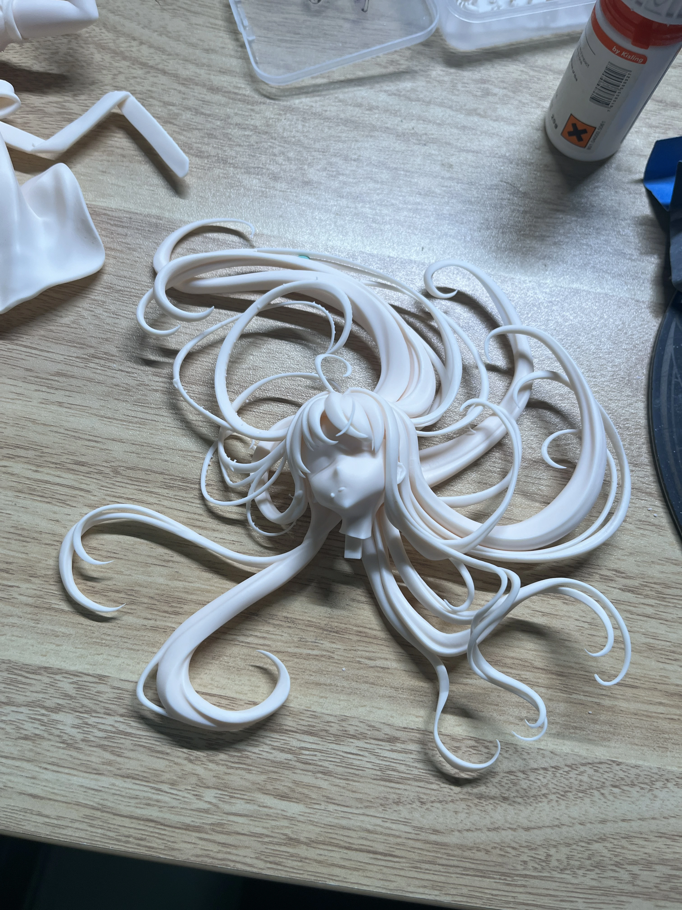
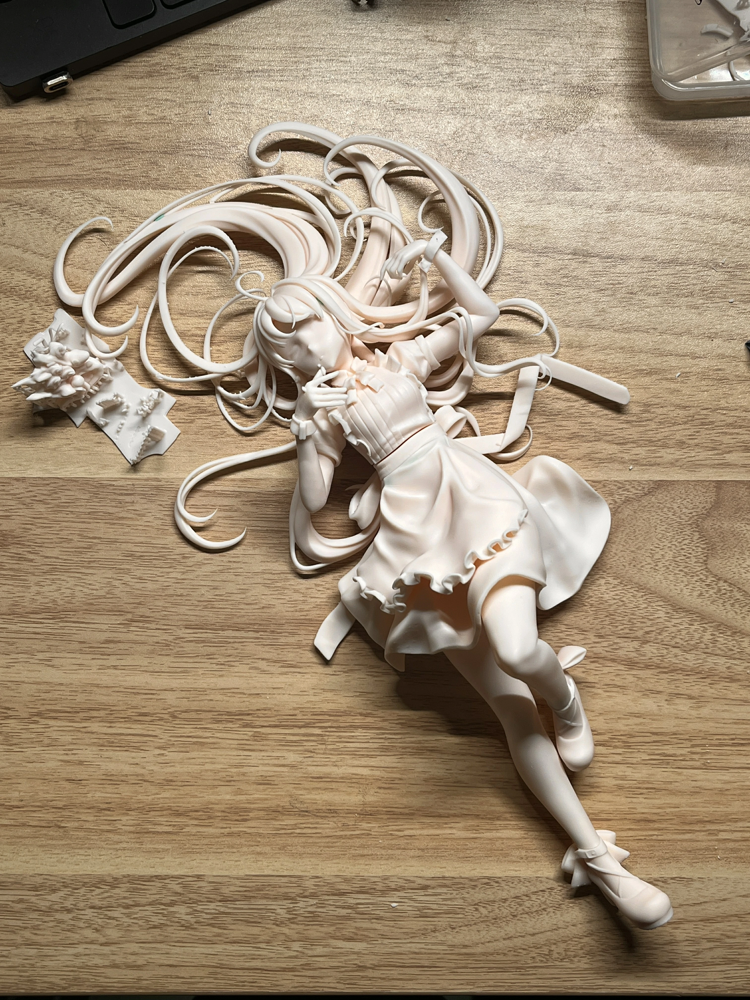
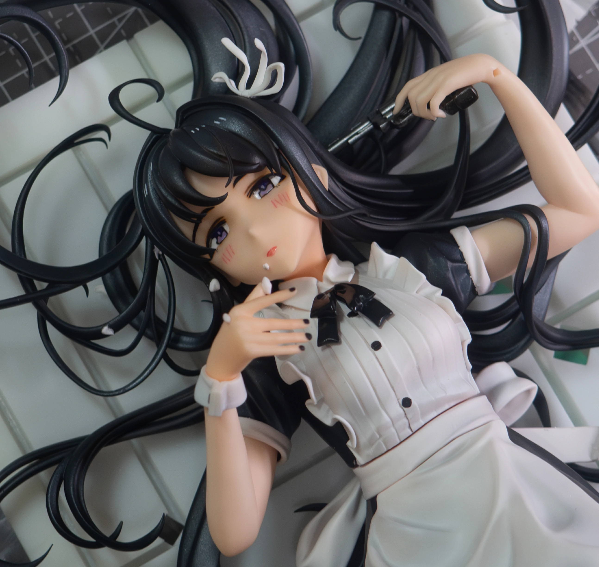
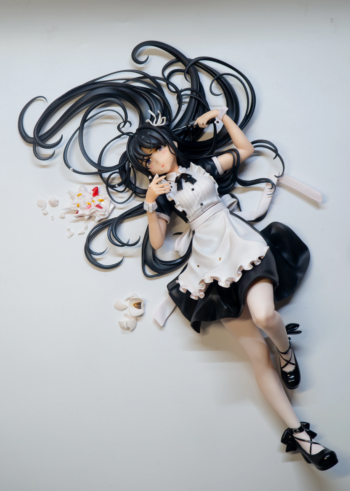

## 極私的極彩色アンサー 闲聊

_MoeSR_x2_universal-fix1%20(1).webp>)
个人在刺一专里最喜欢的一首单曲，哥们这贝斯这吉他，太劲了

我怎么就不会弹（恼）

不仅单曲十分优秀，单曲封面的个性也十分引人注目

歌曲标题为极彩色，但选角却采用昴，并加上女仆装形成了大片没有彩色的黑白

画面最鲜艳的部分，是代替脑浆从脑袋中冲出来的破碎的草莓奶油蛋糕

女仆装是为他人服务的象征，代表着虚假的自己，向这个虚假的外表开了一枪

冲出来的这个部分大概就是昴“極私的極彩色”的部分了

不善解读的我，不看歌词也能从中看出许多故事，这种富有故事感的插画是我的最爱

构图也很棒

MV还是望月画的，东映你是真的有钱

## 3D阶段

言归正传，放下制作过程

服装没有什么可说的，是很经典的女仆装，没有很难做的部分

鞋子原画没有画出来，所以自己选了一个比较稳妥的常规的造型.webp>)

刘海部分苦战了挺久，第一次做不是很明白刘海的结构

在X或者小红书发的上色版本都挺难看的，因为刘海都是早期没调整的样子

调整之后如下

重头戏是头发，说是占了80%的工程量也不为过

但其实意外的，头发做的时候很轻松也很爽

占了大量时间的其实还是头发的拆件，这个真的是非常折磨，当时大概连着拆了好几天......

## 实物阶段

当然拆件只是噩梦的开始罢了，请看支撑：

仇人看了大概都释怀了吧

当然组好后的效果还是很不错的，即使构图扩大到全身，头发也十分有迫力

上色过程几乎没有记录，头发基本被当祖宗供着也没怎么想过拍照

喷黑色确实是有些苦手，加上不太想用有色相的颜色，最终效果不是很好

眼睛尝试了用珐琅，简单的描边填色，远看其实还行？

总之是做完了，26WF冬出了点意外没能成功贩卖，总之期待下一次在WF见面！

