## 闲聊环节

这次涂的是在WF2026冬购入的Zagreus老师制作的泳装柚叶

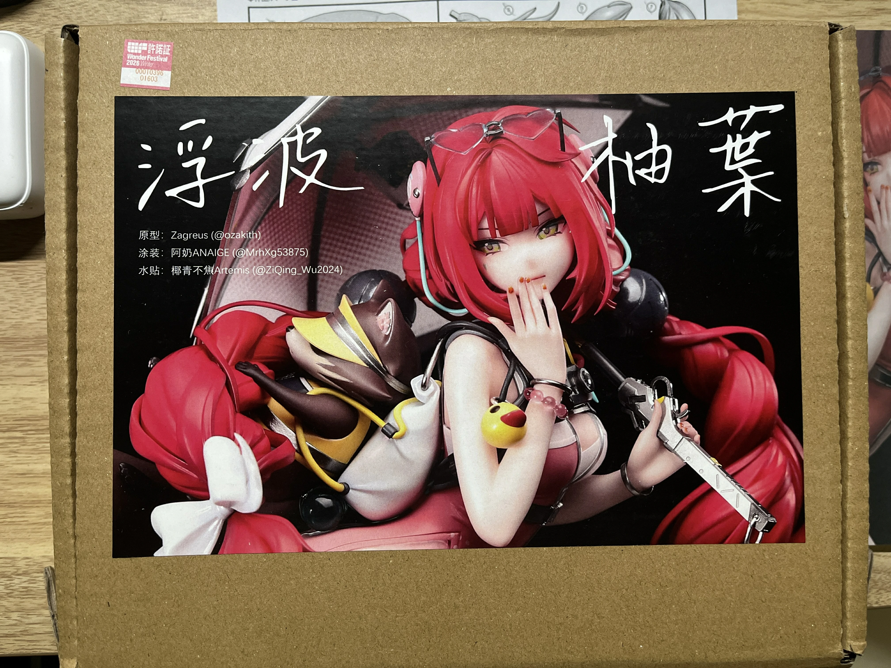
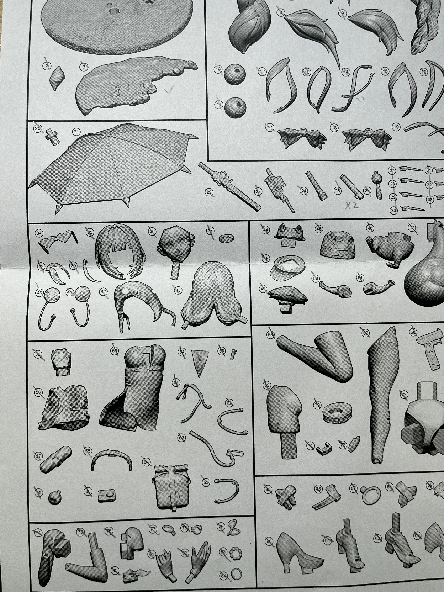

非常灵动的造型，分件很细致，树脂品质也很高，水贴有两张，非常精细，还配了一些金属件

分件总共有90余个，得益于精细的分件，需要遮盖的地方意外的并不是很多，整体的难度比较友好

博主比较铸币，可以看到上面的点件图没有点到太阳镜，但是当时自己却以为没有缺

导致活动结束差不多一个月我开始制作时才发现缺件了

但是Zagreus老师是个大好人还是给我补了件

甚至后续还再发了一版水贴，虽说是原本错印导致的，但我想能发现的人应该也是少之又少的吧

## 假组环节

整体的组装度非常高，所以假组应该算是十分顺利

不过毕竟是九十几个分件，也要花上不少时间

因为是单腿站立，且重心也比较偏向有阿釜的一侧，所以对脚桩的要求很高

好在原模就预留了很长的桩位，让我这个打桩苦手也能很轻松地固定住
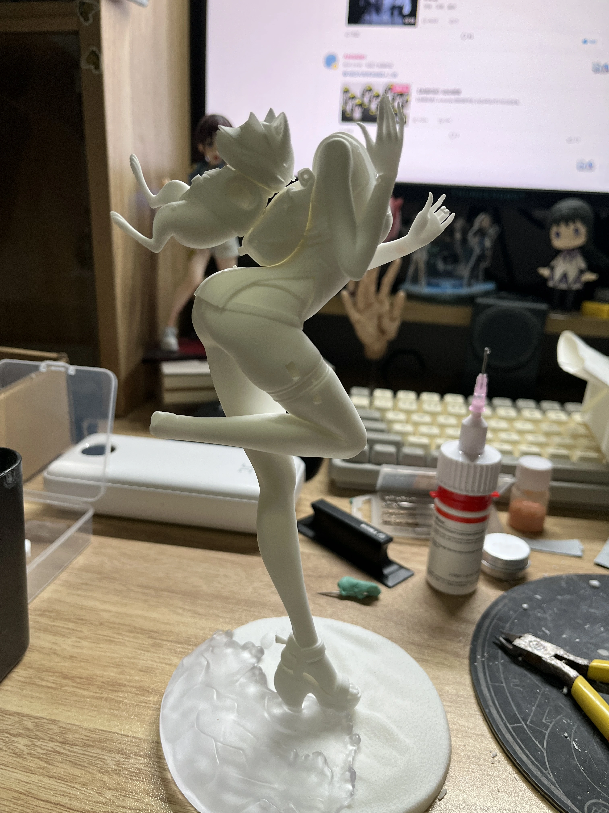

伞面在包装中长期放置会有比较明显的变形，不过只需要热风机略微修整就好

我手里的件在胸部的细节稍微有些丢失，不过这个地方相对比较规整，可以用补土、刻刀、砂纸简单进行修整
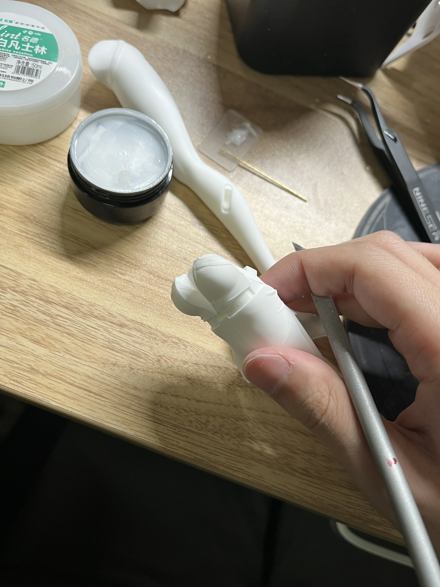

最终的假组形态就已经很漂亮了

## 上色阶段

由于上色时就拍了两张过程图所以只能拿游戏图了

泳装的蝴蝶结、背包以及鞋子都是有偏振色的

博主的上色流程是白色补土打底，上一层非常稀的透明紫+透明粉红来调一个偏紫红的基底，再上一层光油让后续流平更均匀，再上一层蓝、紫、红的变色偏振漆，再上一层光油收尾
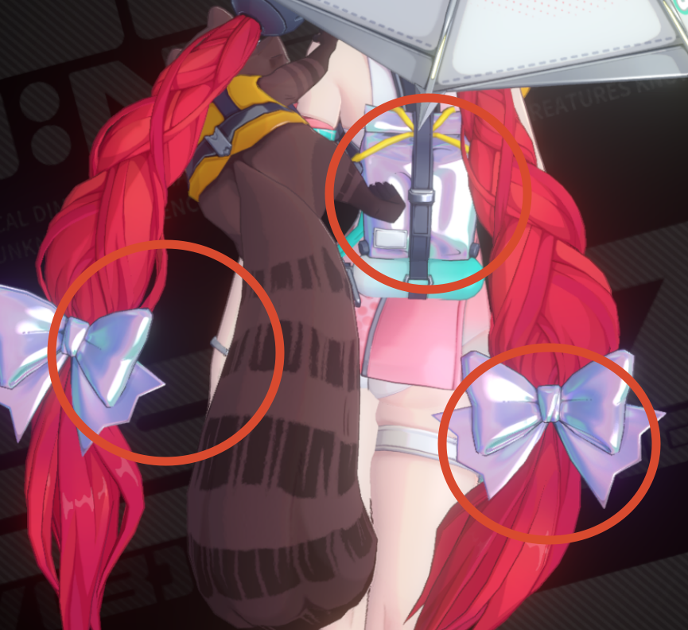

效果大概就是这样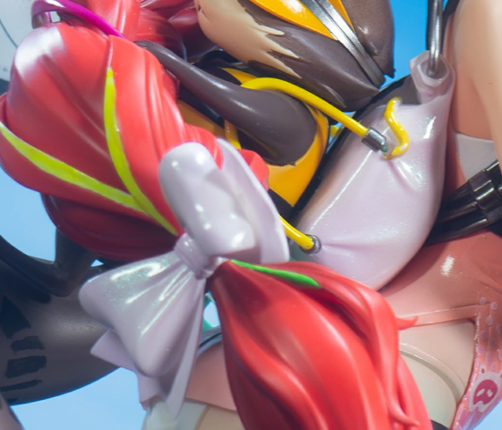

鞋子也是类似的做法，只不过遮盖分色要复杂不少
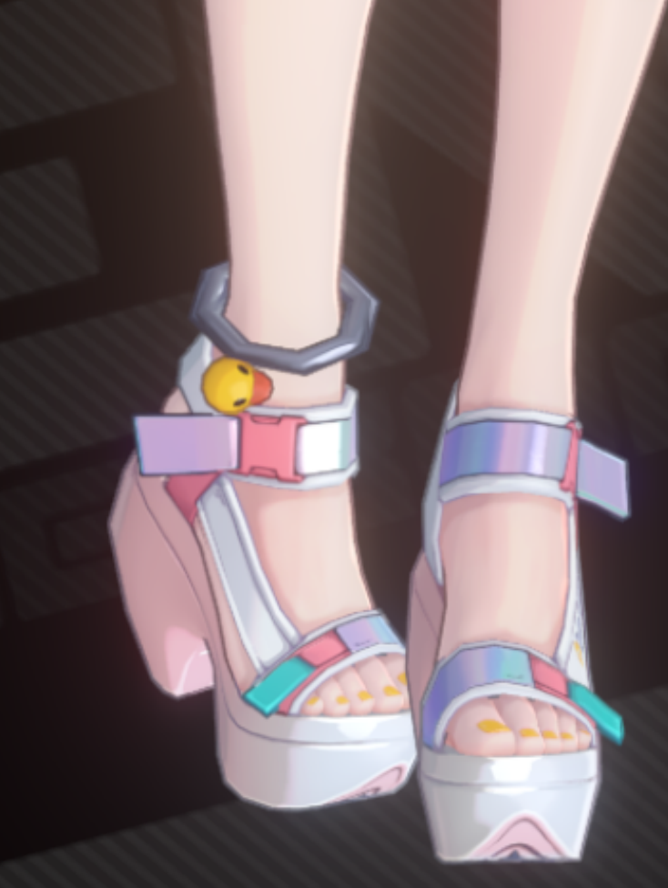

泳装上有很多高亮度高饱和度的青绿色，对整体色彩的氛围有很大的影响

博主的思路是用透明蓝、黄调出尽可能高纯度的青绿色，并加入荧光绿提高颜色的饱和度。

因为是透明件，所以实际的效果受光照的影响会有很大的区别
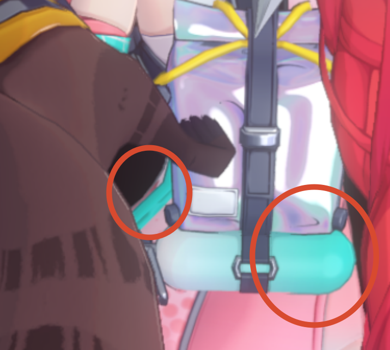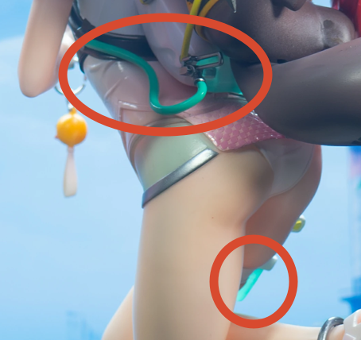

泳装黑色的部分是偏蓝的黑灰色，绑马尾的球则有一定的黑铁质感

博主做的还是偏黑了一点

另外指甲油是粉到黄的渐变
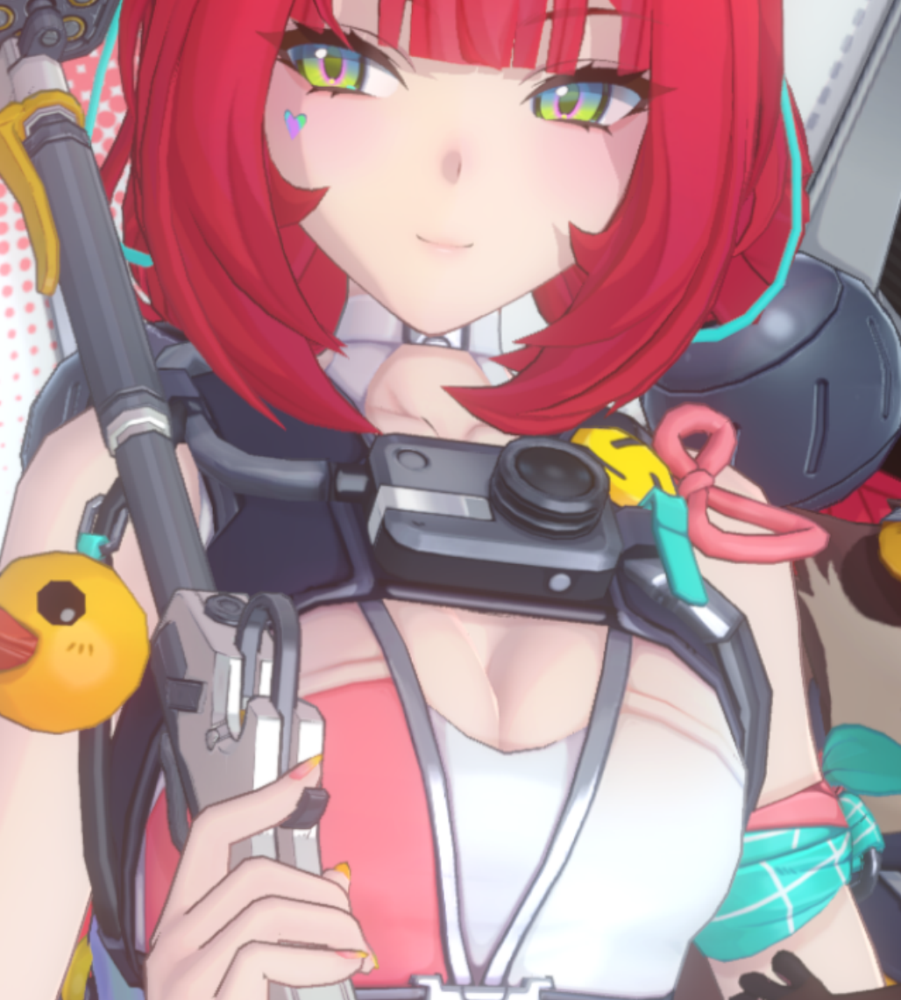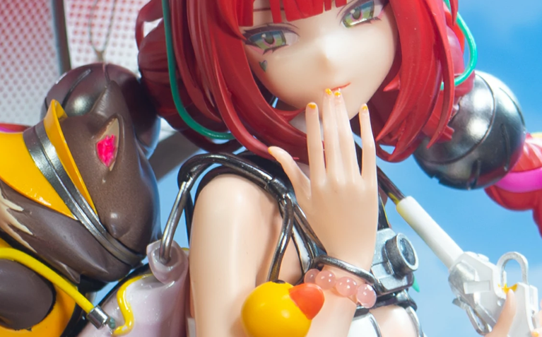

头发部分，因为博主非常超级特别喜欢柚叶专武的头发特效，所以也尝试了做头发的发光挑染

可以看到挑染的发丝很多，颜色也很丰富

但最主要的部分还是黄和紫红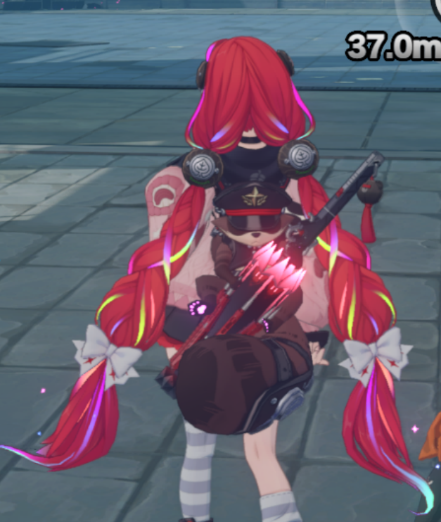

对于有独立分件的发丝，可以用喷涂做出荧光黄、荧光紫红之间的渐变

对于没有分件的大块头发，理想来讲，先喷白色底漆，在对应部分喷涂荧光色，再贴上切割后的发丝遮盖后整体涂装红色可能是比较完美的做法

但是博主没这个能耐，采用的是在红色喷涂完成后，手涂白色底漆覆盖后再手涂荧光色的做法

虽然更加方便，但漆面边缘相对就不太规整，而且手涂的笔痕也是很大的问题

好在最终做出来的效果还算不错
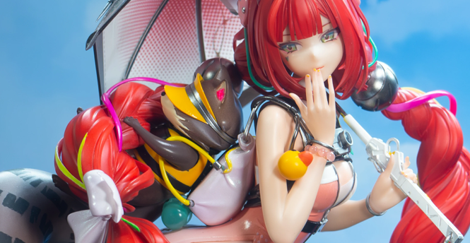

柚叶的雨伞实际上是7片伞面而不是8片，参照游戏内的表现按顺序贴上水贴即可

水贴的贴合度是非常高的，所以关键在于裁剪出锐利且不多不少的边缘

印象里水贴有背胶，只需要一点水让尖端能够移动，就可以用镊子轻松让水贴严丝合缝
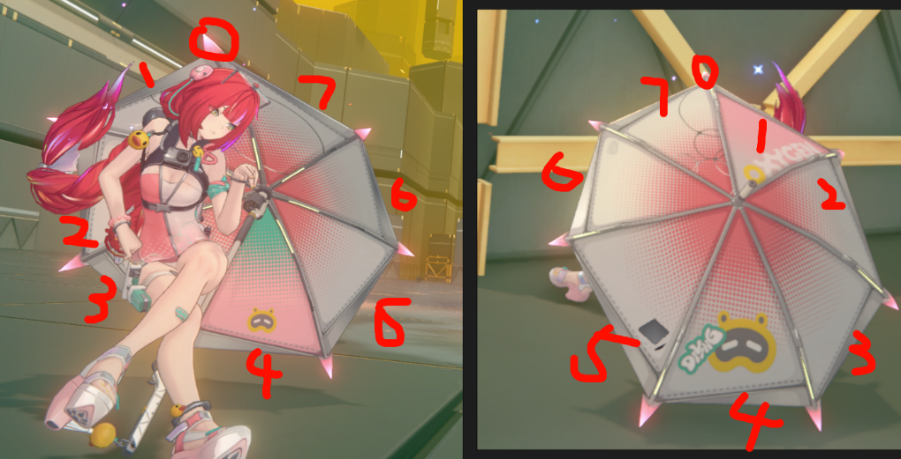

阿釜的尾巴也是博主很在意的部分，游戏里表现花纹用的是手绘风很明显的手绘贴图

博主的做法是再喷涂面漆后，不上光油直接用000这种较粗的毛笔，刻意以随意一些的感觉进行笔涂，保留一些不规整的边缘，效果也不错。
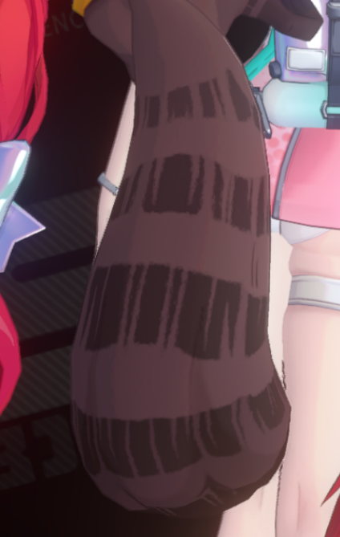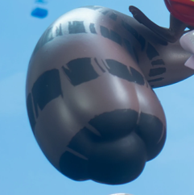

阿釜也是很可爱的！！！

最后再放下成品图吧

拍摄用的是显示器，放的图片就是游戏内的海滩，不过由于我的显示器老化有点暗，拍的有点阴天的感觉（摊手）

总之谢谢观看！
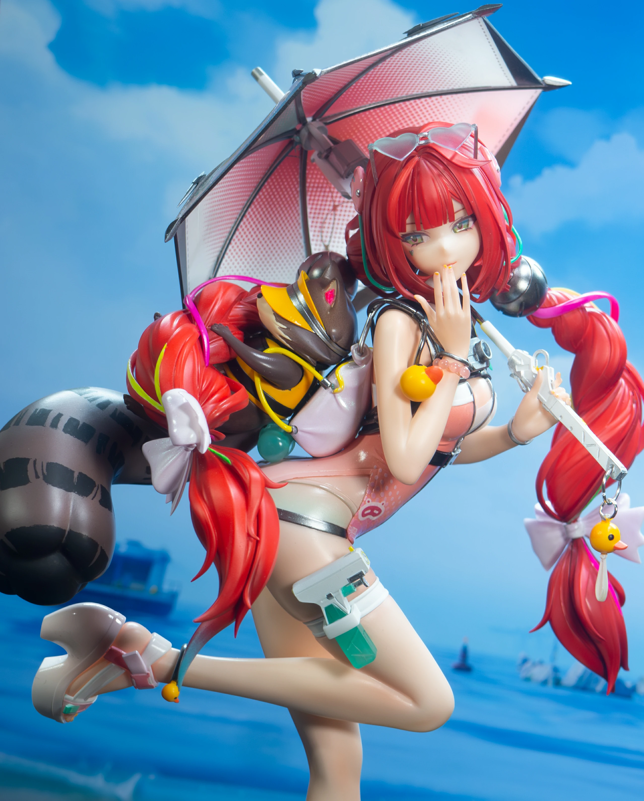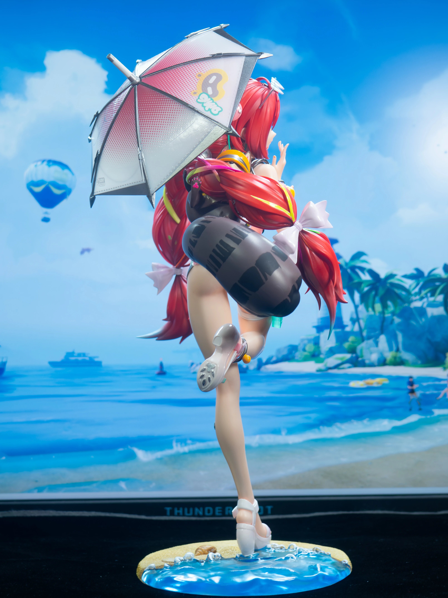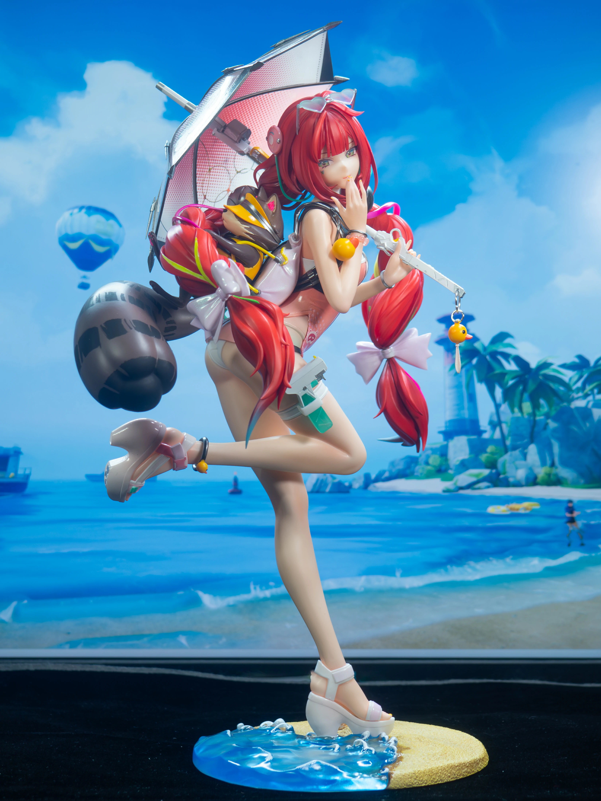
